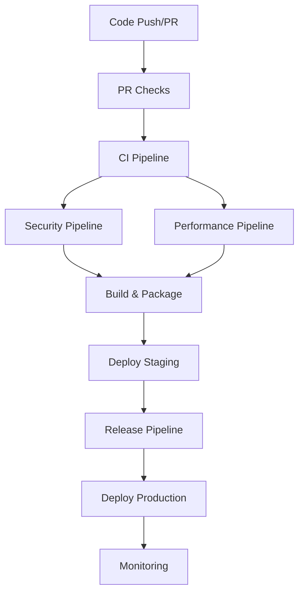

# Mimir Deep Code Research System - CI/CD Pipeline Documentation

## 🚀 Overview

This document describes the comprehensive CI/CD pipeline for the Mimir Deep Code Research System, designed to ensure code quality, security, and reliable deployments while maintaining fast feedback cycles for developers.

## 📋 Pipeline Architecture

### Core Principles
- **Fast Feedback**: Critical checks complete in <5 minutes
- **Security-First**: Automated security scanning and validation
- **Quality Gates**: Multi-layered validation before deployment
- **Zero-Downtime**: Blue-green and rolling deployment strategies
- **Comprehensive Testing**: Unit, integration, security, and performance tests
- **Production-Ready**: Full observability and monitoring integration

### Pipeline Stages



## 🔧 Workflow Files

### 1. `ci.yml` - Main CI Pipeline
**Triggers**: Push to main/develop/master, Pull Requests
**Duration**: ~15-20 minutes
**Purpose**: Comprehensive validation of code changes

#### Jobs:
- **Quality Gates** (10 min): Code formatting, linting, type checking
- **Unit Tests** (15 min): Multi-Python version testing with coverage
- **Integration Tests** (20 min): Full system integration validation
- **Performance Tests** (25 min): Benchmark execution and regression detection
- **Security Scan** (15 min): SAST, dependency scanning, secrets detection
- **Container Build** (20 min): Multi-architecture container builds
- **E2E Tests** (15 min): End-to-end testing in containerized environment
- **Deploy Staging** (30 min): Automated staging deployment
- **Documentation** (10 min): Documentation validation and artifact generation

#### Success Criteria:
- ✅ All tests pass (>85% coverage)
- ✅ No critical security vulnerabilities
- ✅ Performance within baseline (±20%)
- ✅ Container builds successfully
- ✅ Staging deployment healthy

### 2. `pr-checks.yml` - Pull Request Validation
**Triggers**: PR opened, synchronized, ready for review
**Duration**: ~10-15 minutes
**Purpose**: Fast feedback for PR changes

#### Jobs:
- **Quick Quality Checks** (5 min): Fast formatting and linting
- **Comprehensive Quality** (10 min): Full quality validation
- **Unit Tests** (15 min): Core functionality testing
- **Integration Tests Lite** (10 min): Essential integration tests
- **Build Validation** (15 min): Container build verification
- **Security Scan** (10 min): Incremental security analysis
- **Performance Impact** (15 min): Performance regression detection
- **Impact Analysis** (5 min): Change impact assessment

#### Features:
- 🚀 Concurrent execution for speed
- 🎯 Focused on changed files
- ✅ Clear pass/fail status
- 📊 Comprehensive reporting

### 3. `security.yml` - Security Pipeline
**Triggers**: Push, PR, Daily schedule
**Duration**: ~15-20 minutes
**Purpose**: Comprehensive security validation

#### Jobs:
- **SAST Analysis** (20 min): Static application security testing
- **Dependency Scan** (15 min): Vulnerability and license scanning
- **Container Security** (20 min): Container image security analysis
- **Infrastructure Security** (15 min): Infrastructure configuration scanning
- **Secrets Scan** (10 min): Secret detection and validation
- **Compliance Check** (10 min): Regulatory compliance validation

#### Security Coverage:
- 🔒 Code vulnerabilities (Bandit, Semgrep, CodeQL)
- 📦 Dependency vulnerabilities (Safety, pip-audit)
- 🐳 Container security (Trivy, configuration analysis)
- 🏗️ Infrastructure security (Docker Compose, configurations)
- 🔐 Secrets detection (TruffleHog, GitLeaks, custom patterns)
- 📋 Compliance validation (documentation, controls)

### 4. `performance.yml` - Performance Pipeline
**Triggers**: Push to main, PR, Weekly schedule
**Duration**: ~30-45 minutes
**Purpose**: Performance monitoring and regression detection

#### Jobs:
- **Performance Benchmarks** (45 min): Comprehensive benchmarking
- **Regression Analysis** (15 min): Performance regression detection
- **Load Testing** (60 min): Long-running performance validation

#### Benchmark Suites:
- ⚡ Pipeline Performance: End-to-end processing benchmarks
- 📚 Indexing Performance: File processing and indexing speed
- 🔍 Search Performance: Query response time and accuracy
- 💾 Memory Usage: Resource consumption analysis
- 🔄 Load Testing: Concurrent usage and stability

### 5. `deploy-staging.yml` - Staging Deployment
**Triggers**: Push to main, Manual dispatch
**Duration**: ~20-25 minutes
**Purpose**: Automated staging environment deployment

#### Jobs:
- **Pre-deployment Checks** (10 min): Environment and image validation
- **Deploy to Staging** (20 min): Blue-green deployment execution
- **Health Checks** (15 min): Comprehensive health validation
- **Smoke Tests** (10 min): Critical functionality verification
- **Security Validation** (10 min): Production-like security checks
- **Monitoring Setup** (5 min): Observability configuration

#### Features:
- 🔄 Blue-green deployment strategy
- 🏥 Comprehensive health checks
- 🔒 Security validation
- 📊 Monitoring integration
- 🔄 Automatic rollback on failure

### 6. `deploy-production.yml` - Production Deployment
**Triggers**: Manual dispatch only (with approval)
**Duration**: ~45-60 minutes
**Purpose**: Secure production deployment with comprehensive validation

#### Jobs:
- **Pre-production Validation** (20 min): Comprehensive pre-deployment checks
- **Deploy to Production** (45 min): Multi-strategy deployment
- **Production Health Checks** (20 min): Extensive health validation
- **Integration Tests** (15 min): Production environment testing
- **Security Validation** (10 min): Production security verification
- **Monitoring Setup** (10 min): Production monitoring configuration
- **Post-deployment Validation** (15 min): Comprehensive success validation

#### Deployment Strategies:
- 🔄 Rolling Deployment: Gradual instance replacement
- 🔵🟢 Blue-Green Deployment: Full environment switching
- 🐤 Canary Deployment: Gradual traffic shifting

#### Safety Features:
- 🛡️ Manual approval gates
- 💾 Automatic backup creation
- 🔄 Instant rollback capability
- 📊 Real-time monitoring
- 🚨 Automatic failure detection

### 7. `release.yml` - Release Management
**Triggers**: Git tags (v*), Manual dispatch
**Duration**: ~30-40 minutes
**Purpose**: Automated release creation and publishing

#### Jobs:
- **Validate Release** (5 min): Release criteria validation
- **Run CI Pipeline** (20 min): Full CI pipeline execution
- **Build Release Images** (30 min): Multi-architecture release builds
- **Security Release Scan** (20 min): Comprehensive security validation
- **Create GitHub Release** (10 min): Automated release creation
- **Deploy Production** (45 min): Production deployment (non-prerelease)

#### Features:
- 📦 Semantic versioning
- 📝 Automated changelog generation
- 🔒 Container image signing
- 📋 SBOM generation
- 🚀 Automated deployment
- 📢 Release notifications

### 8. `monitoring.yml` - Continuous Monitoring
**Triggers**: Schedule (every 15 minutes), Manual dispatch
**Duration**: ~10-15 minutes
**Purpose**: Continuous system health and performance monitoring

#### Jobs:
- **Health Monitoring** (10 min): Service health validation
- **Performance Monitoring** (15 min): Performance metrics collection
- **Security Monitoring** (10 min): Security status validation
- **Capacity Monitoring** (10 min): Resource utilization analysis
- **Config Validation** (10 min): Monitoring configuration validation

#### Monitoring Coverage:
- 🏥 Health: Service availability and responsiveness
- ⚡ Performance: Response times, throughput, resource usage
- 🔒 Security: Certificate status, vulnerability monitoring
- 📊 Capacity: Resource utilization and forecasting
- ⚙️ Configuration: Monitoring stack validation

## 🔧 Configuration Files

### `dependabot.yml` - Dependency Management
- **Python Dependencies**: Weekly updates (Monday)
- **Docker Dependencies**: Weekly updates (Tuesday)  
- **GitHub Actions**: Weekly updates (Wednesday)
- **Security Grouping**: Prioritized security updates
- **Automatic PR Creation**: With reviewer assignment

### Issue Templates
- **Bug Report**: Structured bug reporting with environment details
- **Feature Request**: Comprehensive feature planning template
- **Security Issue**: Responsible disclosure template

### Pull Request Template
- **Comprehensive Checklist**: Quality, testing, security, documentation
- **Impact Assessment**: Change analysis and deployment considerations
- **Review Guidelines**: Clear guidance for reviewers

## 📊 Quality Gates & Metrics

### Code Quality Requirements
- ✅ Code formatting: Black compliance
- ✅ Linting: Ruff with comprehensive rule set
- ✅ Type checking: MyPy strict mode
- ✅ Test coverage: >85% line coverage
- ✅ Security: No critical vulnerabilities
- ✅ Performance: Within ±20% baseline

### Security Requirements
- 🔒 SAST scanning: Clean Bandit/Semgrep/CodeQL results
- 📦 Dependency scanning: No known critical vulnerabilities
- 🐳 Container scanning: Trivy security validation
- 🔐 Secrets scanning: No exposed secrets
- 📋 Compliance: Security documentation complete

### Performance Requirements
- ⚡ Pipeline processing: <2.0s per repository
- 📚 File indexing: >1000 files/minute
- 🔍 Search queries: <100ms response time
- 💾 Memory usage: <500MB for medium repositories
- 🔄 Concurrent users: Support 10+ simultaneous operations

### Deployment Requirements
- 🏥 Health checks: All endpoints healthy
- 🔒 Security validation: Production security posture verified
- 📊 Performance validation: Metrics within targets
- 🧪 Integration tests: Critical user journeys validated
- 📈 Monitoring: Complete observability active

## 🚀 Usage Examples

### Triggering Builds

```bash
# Trigger CI pipeline
git push origin main

# Create pull request (triggers PR checks)
git push origin feature/new-feature
gh pr create --title "Add new feature" --body "Description"

# Create release (triggers release pipeline)
git tag v1.0.0
git push origin v1.0.0

# Manual staging deployment
gh workflow run deploy-staging.yml

# Manual production deployment
gh workflow run deploy-production.yml -f image-tag=ghcr.io/repo:v1.0.0
```

### Monitoring Pipeline Status

```bash
# Check workflow status
gh run list

# View specific workflow run
gh run view [run-id]

# Download artifacts
gh run download [run-id]

# Check deployment status
gh deployment list
```

### Local Development Workflow

```bash
# Install dependencies
uv sync --extra dev --extra test

# Run quality checks locally
uv run black src tests
uv run ruff check src tests  
uv run mypy src tests

# Run tests
uv run pytest tests/unit/ -v
uv run pytest tests/integration/ -v

# Run security checks
uv run bandit -r src/
uv run safety check

# Build container locally
docker build -t mimir:local .
docker run --rm mimir:local
```

## 🔧 Maintenance & Troubleshooting

### Common Issues

**Build Failures:**
1. Check dependency conflicts in `uv.lock`
2. Verify external tool availability
3. Review test environment setup
4. Check container build context

**Security Scan Failures:**
1. Review Bandit/Semgrep findings
2. Update vulnerable dependencies
3. Fix identified security issues
4. Add security exceptions if needed

**Performance Regressions:**
1. Compare benchmark results
2. Identify slow operations
3. Profile memory usage
4. Optimize critical paths

**Deployment Failures:**
1. Check image availability
2. Verify environment health
3. Review configuration changes
4. Monitor resource capacity

### Pipeline Optimization

**Speed Optimization:**
- ⚡ Parallel job execution
- 📦 Efficient caching strategies
- 🎯 Conditional job execution
- 🔄 Incremental testing

**Resource Optimization:**
- 💾 Shared artifact caching
- 🐳 Optimized container builds
- 📊 Resource usage monitoring
- 🔧 Job timeout management

### Monitoring & Alerting

**Key Metrics:**
- 📈 Pipeline success rate (target: >95%)
- ⏱️ Average pipeline duration (target: <20 min)
- 🔒 Security scan pass rate (target: 100%)
- 🚀 Deployment success rate (target: >99%)

**Alert Conditions:**
- 🚨 Pipeline failure rate >5%
- ⏰ Pipeline duration >30 minutes
- 🔒 Critical security vulnerabilities found
- 🚀 Deployment failures

## 🎯 Best Practices

### Development Workflow
1. **Small, Focused PRs**: Keep changes manageable
2. **Test Locally**: Run quality checks before pushing
3. **Clear Commit Messages**: Follow conventional commit format
4. **Documentation**: Update docs with code changes
5. **Security Mindset**: Consider security implications

### CI/CD Management
1. **Monitor Pipeline Health**: Track success rates and performance
2. **Regular Updates**: Keep dependencies and tools current
3. **Security Reviews**: Regular security posture assessments
4. **Performance Baselines**: Maintain and update performance targets
5. **Disaster Recovery**: Test rollback procedures regularly

### Production Operations
1. **Gradual Rollouts**: Use canary/blue-green deployments
2. **Health Monitoring**: Comprehensive observability
3. **Incident Response**: Clear escalation procedures
4. **Capacity Planning**: Monitor and forecast resource needs
5. **Regular Reviews**: Continuous improvement processes

## 📚 Additional Resources

- [GitHub Actions Documentation](https://docs.github.com/en/actions)
- [Docker Best Practices](https://docs.docker.com/develop/best-practices/)
- [Python Security Guide](https://python-security.readthedocs.io/)
- [Performance Testing Guide](https://pytest-benchmark.readthedocs.io/)
- [Monitoring Best Practices](https://prometheus.io/docs/practices/)

---

This CI/CD pipeline provides comprehensive automation for the Mimir Deep Code Research System, ensuring high quality, security, and reliability in all deployments while maintaining fast feedback cycles for developers.