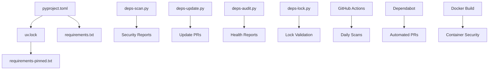

# Dependency Management Guide for Mimir Deep Code Research System

## Overview

This document outlines the comprehensive dependency management workflow implemented for the Mimir project. Our system provides automated security scanning, dependency updates, and validation to ensure a secure and maintainable codebase.

## Table of Contents

- [Architecture](#architecture)
- [Tools and Scripts](#tools-and-scripts)
- [Automated Workflows](#automated-workflows)
- [Security Features](#security-features)
- [Usage Guide](#usage-guide)
- [Troubleshooting](#troubleshooting)
- [Best Practices](#best-practices)

## Architecture

### Dependency Management Stack



### Key Components

1. **Enhanced pyproject.toml**: Comprehensive dependency metadata with security annotations
2. **Automated Security Scripts**: Four specialized scripts for different aspects of dependency management
3. **CI/CD Integration**: GitHub Actions workflows for continuous security validation
4. **Dependabot Configuration**: Automated dependency updates with security grouping
5. **Docker Security**: Multi-stage builds with dependency scanning and hardening

## Tools and Scripts

### Core Scripts (`scripts/deps/`)

#### 1. `deps-scan.py` - Security Vulnerability Scanner

**Purpose**: Comprehensive security scanning using multiple tools

**Features**:
- Multi-tool scanning: safety, pip-audit, bandit, semgrep
- Vulnerability severity filtering
- Automated report generation
- CI/CD integration
- Critical issue detection

**Usage**:
```bash
# Basic security scan
python scripts/deps/deps-scan.py

# High-severity issues only
python scripts/deps/deps-scan.py --severity high

# JSON output for automation
python scripts/deps/deps-scan.py --report-format json --output security_report.json
```

**Output**:
- Security scan reports (text/JSON)
- Vulnerability count and severity breakdown
- Critical issue alerts
- Remediation recommendations

#### 2. `deps-update.py` - Automated Update Manager

**Purpose**: Intelligent dependency updates with testing and validation

**Features**:
- Security-first update prioritization
- Automated testing after updates
- Git branch management
- Pull request creation
- Update rollback on failure

**Usage**:
```bash
# Security updates only
python scripts/deps/deps-update.py --security-only

# All updates with PR creation
python scripts/deps/deps-update.py --create-pr

# Auto-merge critical security updates
python scripts/deps/deps-update.py --security-only --auto-merge-security
```

**Workflow**:
1. Analyze outdated dependencies
2. Categorize by security priority
3. Apply updates in batches
4. Run comprehensive tests
5. Create pull requests
6. Auto-merge critical security fixes

#### 3. `deps-audit.py` - Comprehensive Auditing

**Purpose**: Detailed dependency health and compliance analysis

**Features**:
- License compliance checking
- Dependency tree analysis
- Package bloat detection
- Security risk assessment
- Supply chain analysis

**Usage**:
```bash
# Full audit with license checking
python scripts/deps/deps-audit.py --check-licenses --analyze-bloat

# JSON output for reporting
python scripts/deps/deps-audit.py --format json --output audit_report.json
```

**Analysis Areas**:
- License compatibility matrix
- Dependency depth and complexity
- Duplicate dependencies
- Security-relevant packages
- Package size optimization

#### 4. `deps-lock.py` - Lock File Management

**Purpose**: Dependency lock file validation and management

**Features**:
- uv.lock validation
- Cross-platform compatibility checks
- Hash verification
- Lock file regeneration
- Consistency validation

**Usage**:
```bash
# Validate all lock files
python scripts/deps/deps-lock.py --validate

# Check platform compatibility
python scripts/deps/deps-lock.py --check-platform

# Regenerate with hashes
python scripts/deps/deps-lock.py --regenerate --add-hashes
```

## Automated Workflows

### GitHub Actions Integration

#### Daily Security Scanning

**Trigger**: Daily at 6 AM UTC
**Workflow**: `.github/workflows/dependency-management.yml`

**Actions**:
1. Comprehensive security audit
2. Vulnerability scanning
3. Lock file validation
4. Critical issue alerting
5. Security report generation

#### Weekly Health Reports

**Trigger**: Sundays at 8 AM UTC
**Workflow**: `.github/workflows/dependency-management.yml`

**Actions**:
1. Full dependency audit
2. License compliance check
3. Package bloat analysis
4. Health report generation
5. GitHub issue creation

#### Automated Updates

**Trigger**: Manual or scheduled
**Workflow**: `.github/workflows/dependency-management.yml`

**Features**:
- Security-first update strategy
- Automated testing and validation
- Pull request creation
- Auto-merge for critical security fixes
- Rollback on test failures

### Dependabot Configuration

**File**: `.github/dependabot.yml`

**Features**:
- Daily security updates
- Grouped dependency updates
- Security-focused prioritization
- Automated PR creation
- Review team assignment

**Groups**:
- **critical-security**: Immediate security updates
- **development-tools**: Testing and linting tools
- **web-framework**: FastAPI ecosystem
- **ai-ml-stack**: AI/ML dependencies
- **code-analysis**: Code processing tools

## Security Features

### Multi-Layer Security Approach

1. **Vulnerability Scanning**:
   - PyPI vulnerability database (safety)
   - Enhanced dependency auditing (pip-audit)
   - Static analysis security testing (bandit)
   - Advanced SAST (semgrep)

2. **Supply Chain Security**:
   - Package signature verification
   - Dependency tree analysis
   - License compliance checking
   - Trusted publisher validation

3. **Container Security**:
   - Multi-stage builds with security hardening
   - Dependency hash verification
   - Runtime security scanning
   - Minimal attack surface

4. **Automated Response**:
   - Critical vulnerability alerting
   - Automatic security updates
   - Issue creation and tracking
   - Rollback on failures

### Security Thresholds

- **Critical**: Immediate action required
- **High**: Update within 24 hours
- **Medium**: Update within 1 week
- **Low**: Update in regular cycle

## Usage Guide

### Setting Up the System

1. **Initial Configuration**:
   ```bash
   # Install security scanning tools
   uv add bandit safety pip-audit semgrep --group security-scan
   
   # Configure pre-commit hooks
   pre-commit install
   
   # Run initial security scan
   python scripts/deps/deps-scan.py --severity medium
   ```

2. **Daily Operations**:
   ```bash
   # Check for security updates
   python scripts/deps/deps-update.py --security-only --dry-run
   
   # Apply security updates
   python scripts/deps/deps-update.py --security-only --create-pr
   ```

3. **Weekly Maintenance**:
   ```bash
   # Full dependency audit
   python scripts/deps/deps-audit.py --check-licenses --analyze-bloat
   
   # Lock file validation
   python scripts/deps/deps-lock.py --validate --check-platform
   ```

### CI/CD Integration

The dependency management system is automatically integrated into the CI/CD pipeline:

- **Pull Request Checks**: Security scanning on every PR
- **Daily Security Scans**: Automated vulnerability detection
- **Weekly Health Reports**: Comprehensive dependency analysis
- **Automated Updates**: Security-focused dependency maintenance

### Container Deployment

```bash
# Build with security scanning
docker build --target production -t mimir:secure .

# Run security validation
docker run --rm mimir:secure python scripts/deps/deps-scan.py --severity critical
```

## Troubleshooting

### Common Issues and Solutions

#### Security Scan Failures

**Issue**: Security scan fails with critical vulnerabilities
**Solution**:
1. Review the security report
2. Identify vulnerable packages
3. Update to secure versions
4. Test thoroughly
5. Deploy updates immediately

#### Update Failures

**Issue**: Dependency updates break tests
**Solution**:
1. Review the update log
2. Identify breaking changes
3. Update code compatibility
4. Run comprehensive tests
5. Create targeted fixes

#### Lock File Inconsistencies

**Issue**: Lock files are out of sync
**Solution**:
```bash
# Regenerate lock files
python scripts/deps/deps-lock.py --regenerate

# Validate consistency
python scripts/deps/deps-lock.py --validate
```

#### Container Build Issues

**Issue**: Docker build fails on security scanning
**Solution**:
1. Check dependency versions in pyproject.toml
2. Update vulnerable packages
3. Rebuild with clean cache
4. Verify security scanning tools are installed

### Debug Commands

```bash
# Verbose security scanning
python scripts/deps/deps-scan.py --severity low --report-format json

# Dry-run dependency updates
python scripts/deps/deps-update.py --dry-run --security-only

# Detailed audit with license checking
python scripts/deps/deps-audit.py --format text --check-licenses
```

## Best Practices

### Development Workflow

1. **Before Adding Dependencies**:
   - Check security status
   - Verify license compatibility
   - Assess necessity and alternatives
   - Review supply chain security

2. **Regular Maintenance**:
   - Run security scans before releases
   - Update dependencies weekly
   - Review audit reports monthly
   - Validate lock files after updates

3. **Security Response**:
   - Monitor security alerts daily
   - Apply critical updates immediately
   - Test security updates thoroughly
   - Document security decisions

### Dependency Selection Criteria

1. **Security**: Active maintenance, security track record
2. **Licensing**: Compatible with project license (MIT)
3. **Maintenance**: Active development, responsive maintainers
4. **Dependencies**: Minimal transitive dependencies
5. **Performance**: Reasonable resource usage

### Emergency Procedures

#### Critical Security Vulnerability

1. **Immediate Response** (within 2 hours):
   - Assess impact and severity
   - Identify vulnerable components
   - Create emergency update branch
   - Apply security patches

2. **Testing and Validation** (within 4 hours):
   - Run comprehensive test suite
   - Validate security fix effectiveness
   - Perform integration testing
   - Review for breaking changes

3. **Deployment** (within 6 hours):
   - Deploy to staging environment
   - Perform security validation
   - Deploy to production
   - Monitor for issues

4. **Post-Incident** (within 24 hours):
   - Document incident response
   - Update security procedures
   - Enhance monitoring
   - Communicate with stakeholders

## Configuration Files

### Key Configuration Files

- `pyproject.toml`: Dependency specifications with security annotations
- `uv.lock`: Locked dependency versions with hashes
- `requirements.txt`: Runtime dependencies
- `requirements-pinned.txt`: Pinned dependencies with hashes
- `.github/dependabot.yml`: Automated update configuration
- `.github/workflows/dependency-management.yml`: CI/CD workflows

### Security Configuration

```toml
[tool.dependency-security]
# Critical security dependencies
critical-packages = [
    "cryptography",
    "fastapi", 
    "pydantic",
    "uvicorn",
    "httpx"
]

# Security audit configuration
audit-policy = "strict"
vulnerability-threshold = "medium"
auto-update-security = true
security-scan-schedule = "daily"
```

## Monitoring and Alerting

### Automated Monitoring

- **Daily Security Scans**: Detect new vulnerabilities
- **Weekly Health Reports**: Track dependency health trends
- **Critical Alerts**: Immediate notification of security issues
- **Update Tracking**: Monitor dependency update success rates

### Metrics and KPIs

- **Security Response Time**: Time from vulnerability disclosure to fix
- **Update Success Rate**: Percentage of successful dependency updates
- **Test Coverage Impact**: Changes in test coverage after updates
- **Security Scan Score**: Overall security posture metric

## Integration with Development Tools

### IDE Integration

- Security scanning in development environment
- Dependency update suggestions
- License compliance warnings
- Vulnerability highlighting

### Pre-commit Hooks

```yaml
repos:
  - repo: local
    hooks:
      - id: security-scan
        name: Security Scan
        entry: python scripts/deps/deps-scan.py --severity high
        language: system
        always_run: true
```

## Future Enhancements

### Planned Features

1. **Machine Learning**: Predictive vulnerability assessment
2. **Policy as Code**: Automated compliance checking
3. **Supply Chain**: Enhanced provenance tracking
4. **Performance**: Dependency performance impact analysis
5. **Integration**: Enhanced IDE and tool integrations

### Roadmap

- **Q1 2025**: Enhanced ML-based vulnerability prediction
- **Q2 2025**: Automated license compliance tooling
- **Q3 2025**: Supply chain security enhancements
- **Q4 2025**: Performance impact analysis integration

---

This dependency management system provides a comprehensive, security-first approach to managing dependencies in the Mimir project. It combines automated tooling, security scanning, and intelligent update management to maintain a secure and up-to-date codebase while minimizing operational overhead.