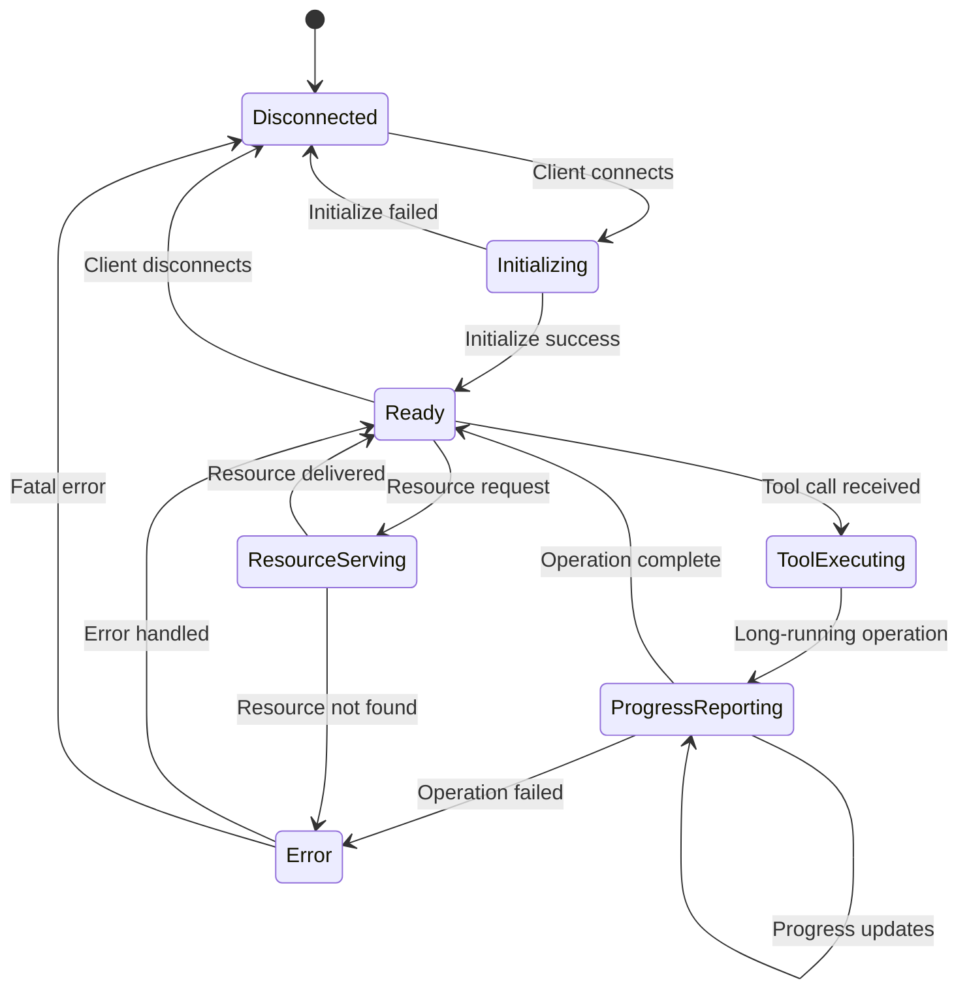

# MCP Protocol Interaction Diagram

## Overview
This diagram shows the detailed interaction between MCP clients and the Mimir server, including the stdio protocol flow, tool invocations, resource serving, and real-time status updates.

```mermaid
sequenceDiagram
    participant Client as MCP Client<br/>(AI Agent/Claude)
    participant Server as Mimir MCP Server
    participant Security as Security Layer
    participant Pipeline as Pipeline Controller
    participant External as External Tools<br/>(Git, RepoMapper, etc.)
    participant Storage as Storage Layer

    %% Initialization
    Note over Client,Storage: Initialization Phase
    Client->>Server: initialize request
    Server->>Security: Validate client
    Security-->>Server: Authentication OK
    Server-->>Client: initialize response<br/>(capabilities, tools, resources)

    %% Tool Discovery
    Note over Client,Storage: Tool Discovery Phase
    Client->>Server: tools/list request
    Server-->>Client: Available tools:<br/>- ensure_repo_index<br/>- get_repo_bundle<br/>- search_repo<br/>- ask_index<br/>- cancel

    %% Resource Discovery
    Client->>Server: resources/list request
    Server-->>Client: Available resources:<br/>- Status JSON<br/>- Manifest JSON<br/>- Logs Markdown<br/>- Bundle Artifacts

    %% Indexing Operation
    Note over Client,Storage: Repository Indexing
    Client->>Server: tools/call: ensure_repo_index<br/>{path: "/repo", rev: "main"}
    Server->>Security: Validate parameters
    Security->>Security: Sanitize paths<br/>Validate repository access
    Security-->>Server: Validation passed
    
    Server->>Pipeline: Start indexing pipeline
    activate Pipeline
    
    %% Stage-by-stage execution with progress updates
    Pipeline->>External: Stage 1: Git file discovery
    External-->>Pipeline: File list + overlay
    Pipeline->>Server: Progress: 16% (Acquire complete)
    Server-->>Client: Resource update notification<br/>status.json updated
    
    Pipeline->>External: Stage 2: RepoMapper AST analysis
    External-->>Pipeline: Dependency graph + rankings
    Pipeline->>Server: Progress: 33% (RepoMapper complete)
    Server-->>Client: Resource update notification<br/>status.json updated
    
    Pipeline->>External: Stage 3: Serena symbol analysis
    External-->>Pipeline: Symbol graph + types
    Pipeline->>Server: Progress: 50% (Serena complete)
    Server-->>Client: Resource update notification<br/>status.json updated
    
    Pipeline->>External: Stage 4: LEANN vector generation
    External-->>Pipeline: Vector embeddings
    Pipeline->>Server: Progress: 66% (LEANN complete)
    Server-->>Client: Resource update notification<br/>status.json updated
    
    Pipeline->>Storage: Stage 5: Snippet extraction
    Storage-->>Pipeline: Context-enriched snippets
    Pipeline->>Server: Progress: 83% (Snippets complete)
    Server-->>Client: Resource update notification<br/>status.json updated
    
    Pipeline->>Storage: Stage 6: Bundle packaging
    Storage-->>Pipeline: Compressed artifacts
    Pipeline->>Server: Progress: 100% (Complete)
    deactivate Pipeline
    
    Server-->>Client: Tool response:<br/>{index_id: "ulid_12345", status: "complete"}

    %% Resource Retrieval
    Note over Client,Storage: Status Monitoring
    Client->>Server: resources/read: status.json
    Server->>Storage: Retrieve status
    Storage-->>Server: Current pipeline status
    Server-->>Client: Status JSON with progress details

    Client->>Server: resources/read: manifest.json
    Server->>Storage: Retrieve manifest
    Storage-->>Server: Index metadata
    Server-->>Client: Complete index manifest

    %% Search Operation
    Note over Client,Storage: Search & Query
    Client->>Server: tools/call: search_repo<br/>{index_id: "ulid_12345", query: "authentication"}
    Server->>Security: Validate search parameters
    Security-->>Server: Parameters validated
    
    Server->>Pipeline: Execute hybrid search
    activate Pipeline
    Pipeline->>Storage: Vector similarity search
    Storage-->>Pipeline: Vector results
    Pipeline->>Storage: Symbol name search
    Storage-->>Pipeline: Symbol results
    Pipeline->>Storage: Graph expansion
    Storage-->>Pipeline: Related symbols
    deactivate Pipeline
    
    Server-->>Client: Search results with citations<br/>and confidence scores

    %% AI-Powered Analysis
    Note over Client,Storage: Intelligent Analysis
    Client->>Server: tools/call: ask_index<br/>{index_id: "ulid_12345", question: "How does auth work?"}
    Server->>Security: Validate question parameters
    Security-->>Server: Question sanitized
    
    Server->>Pipeline: Multi-hop reasoning search
    activate Pipeline
    Pipeline->>Storage: Gather relevant context
    Storage-->>Pipeline: Code snippets + symbols
    Pipeline->>External: LLM integration (Gemini)
    External-->>Pipeline: AI-generated analysis
    deactivate Pipeline
    
    Server-->>Client: Comprehensive answer with<br/>evidence and citations

    %% Error Handling Example
    Note over Client,Storage: Error Handling
    Client->>Server: tools/call: search_repo<br/>{index_id: "invalid_id"}
    Server->>Security: Validate parameters
    Security-->>Server: Index ID not found
    Server-->>Client: Error response:<br/>{error: "Index not found", code: "INDEX_NOT_FOUND"}

    %% Cancellation
    Note over Client,Storage: Operation Cancellation
    Client->>Server: tools/call: cancel<br/>{operation_id: "ulid_12345"}
    Server->>Pipeline: Cancel operation
    Pipeline->>External: Terminate processes
    Pipeline->>Server: Cancellation confirmed
    Server-->>Client: Cancellation successful

    %% Cleanup
    Note over Client,Storage: Session Cleanup
    Client->>Server: disconnect
    Server->>Pipeline: Clean up resources
    Server->>Storage: Persist cache state
    Server-->>Client: Goodbye
```



## MCP Protocol Components

### Protocol Foundation
- **Transport**: stdio-based JSON-RPC 2.0 communication
- **Encoding**: UTF-8 text with newline-delimited JSON messages
- **Session**: Stateful connection with initialization handshake
- **Error Handling**: Structured error responses with recovery guidance

### Tool Interface Specification

#### `ensure_repo_index`
```json
{
  "name": "ensure_repo_index",
  "description": "Create or update repository index",
  "inputSchema": {
    "type": "object",
    "properties": {
      "path": {"type": "string", "description": "Repository path"},
      "rev": {"type": "string", "description": "Git revision (optional)"},
      "language": {"type": "string", "default": "ts"},
      "index_opts": {"type": "object", "description": "Index options"}
    },
    "required": ["path"]
  }
}
```

#### `search_repo`
```json
{
  "name": "search_repo",
  "description": "Hybrid search across repository index",
  "inputSchema": {
    "type": "object",
    "properties": {
      "index_id": {"type": "string", "description": "Index identifier"},
      "query": {"type": "string", "description": "Search query"},
      "k": {"type": "integer", "default": 20, "description": "Result limit"},
      "features": {
        "type": "object",
        "properties": {
          "vector": {"type": "boolean", "default": true},
          "symbol": {"type": "boolean", "default": true},
          "graph": {"type": "boolean", "default": true}
        }
      },
      "context_lines": {"type": "integer", "default": 5}
    },
    "required": ["index_id", "query"]
  }
}
```

#### `ask_index`
```json
{
  "name": "ask_index",
  "description": "AI-powered code analysis and questions",
  "inputSchema": {
    "type": "object",
    "properties": {
      "index_id": {"type": "string", "description": "Index identifier"},
      "question": {"type": "string", "description": "Natural language question"},
      "context_lines": {"type": "integer", "default": 5}
    },
    "required": ["index_id", "question"]
  }
}
```

### Resource Interface Specification

#### Status Resource (`status.json`)
```json
{
  "uri": "mimir://status/{index_id}",
  "name": "Index Status",
  "description": "Real-time pipeline status and progress",
  "mimeType": "application/json"
}
```

**Example Status Content:**
```json
{
  "index_id": "01HQRS5M7K8N2P4Q6RSTUVWXYZ",
  "status": "running",
  "stage": "serena",
  "progress": 50,
  "stages": {
    "acquire": {"status": "complete", "progress": 100},
    "repomapper": {"status": "complete", "progress": 100},
    "serena": {"status": "running", "progress": 75},
    "leann": {"status": "pending", "progress": 0},
    "snippets": {"status": "pending", "progress": 0},
    "bundle": {"status": "pending", "progress": 0}
  },
  "error": null,
  "started_at": "2024-01-15T10:30:00Z",
  "updated_at": "2024-01-15T10:35:30Z"
}
```

#### Manifest Resource (`manifest.json`)
```json
{
  "uri": "mimir://manifest/{index_id}",
  "name": "Index Manifest",
  "description": "Complete index metadata and capabilities",
  "mimeType": "application/json"
}
```

#### Logs Resource (`logs.md`)
```json
{
  "uri": "mimir://logs/{index_id}",
  "name": "Processing Logs",
  "description": "Human-readable processing logs in Markdown",
  "mimeType": "text/markdown"
}
```

### Protocol State Machine



## Real-time Communication Patterns

### Progress Updates
- **Push Model**: Server proactively notifies clients of status changes
- **Resource Notifications**: Client receives resource update notifications
- **Polling Fallback**: Clients can poll status resources if needed
- **Cancellation Support**: Operations can be cancelled mid-execution

### Error Recovery
- **Graceful Degradation**: Partial results returned when possible
- **Retry Logic**: Automatic retry for transient failures
- **Error Context**: Detailed error information for debugging
- **Recovery Suggestions**: Actionable guidance for error resolution

### Performance Optimization
- **Streaming Responses**: Large responses sent in chunks when possible
- **Compression**: JSON response compression for bandwidth efficiency
- **Caching**: Intelligent caching of expensive operations
- **Connection Reuse**: Persistent connections for multiple operations

## Client Integration Examples

### TypeScript Client
```typescript
import { Client } from '@modelcontextprotocol/sdk/client/index.js';

const client = new Client({
  name: "mimir-client",
  version: "1.0.0"
});

// Start indexing
const result = await client.request({
  method: "tools/call",
  params: {
    name: "ensure_repo_index",
    arguments: {
      path: "/path/to/repo",
      language: "ts"
    }
  }
});

// Monitor progress
const status = await client.request({
  method: "resources/read",
  params: {
    uri: `mimir://status/${result.index_id}`
  }
});
```

### Python Client
```python
import json
from mcp import Client

async def index_repository():
    async with Client() as client:
        await client.initialize()
        
        # Start indexing
        result = await client.call_tool(
            "ensure_repo_index",
            path="/path/to/repo",
            language="py"
        )
        
        # Search the index
        search_results = await client.call_tool(
            "search_repo",
            index_id=result["index_id"],
            query="authentication methods",
            k=10
        )
        
        return search_results
```

## Security Integration

### Authentication Flow
1. Client provides API key in initialization
2. Server validates key against configured credentials
3. Session established with appropriate permissions
4. All subsequent requests authenticated via session

### Authorization Enforcement
- Tool access controlled by permission matrix
- Resource access limited by repository scope
- Operation limits enforced per client session
- Audit logging for all security decisions

### Data Protection
- All communication encrypted in transit
- Sensitive data redacted from logs and responses
- File access restricted to authorized repository paths
- Memory protection for intermediate processing artifacts