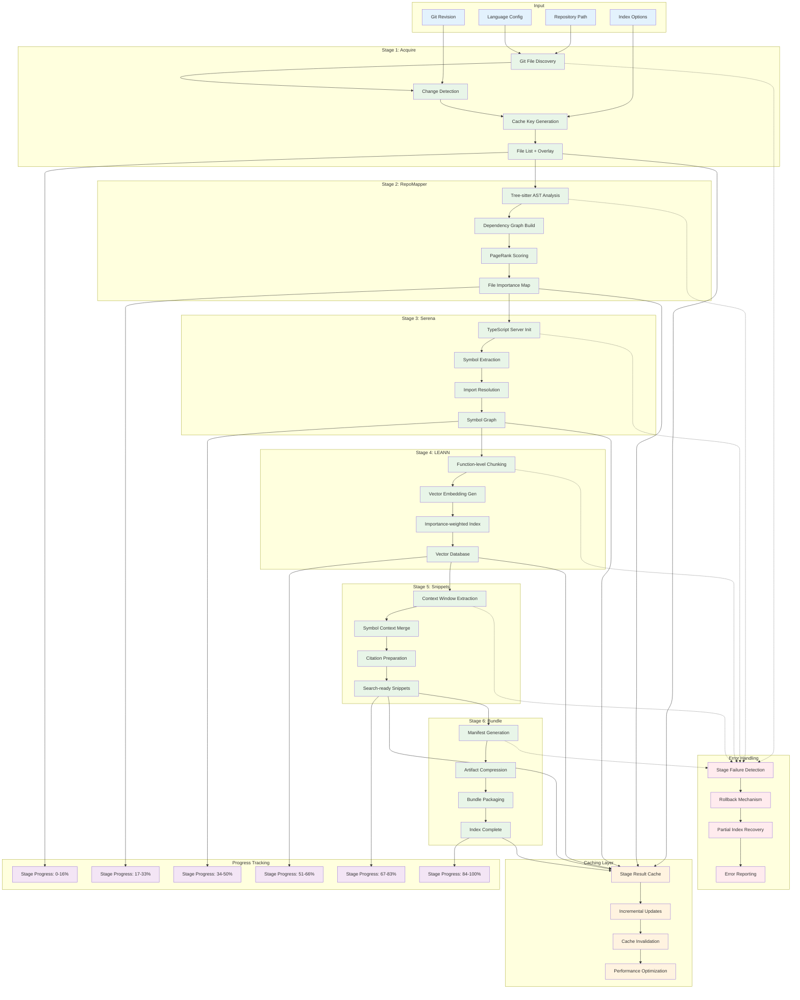

# Pipeline Flow Diagram

## Overview
This diagram shows the detailed flow through the six-stage indexing pipeline, including stage dependencies, data transformations, and error handling.

## Stage Dependencies and Sequencing

### Sequential Dependencies
- **Acquire → RepoMapper**: File list required for AST analysis
- **RepoMapper → Serena**: Dependency graph needed for symbol resolution priority
- **Serena → LEANN**: Symbol information enhances vector embedding quality
- **LEANN → Snippets**: Vector index needed for semantic snippet selection
- **Snippets → Bundle**: All artifacts must be ready for packaging

### Parallel Opportunities
- Within each stage, file processing can be parallelized
- Cache validation can occur concurrently with main processing
- Progress reporting runs independently of stage execution

## Stage Input/Output Details

### Stage 1: Acquire
**Input**: Repository path, git revision, configuration
**Output**: Filtered file list, change overlay, cache key
**Key Operations**:
- `git ls-files` for tracked file enumeration
- `git hash-object` for change detection
- File type filtering based on configuration
- Cache key computation from HEAD + config hash

### Stage 2: RepoMapper
**Input**: File list from Acquire stage
**Output**: Dependency graph, file importance scores
**Key Operations**:
- Tree-sitter AST parsing for each file
- Dependency relationship extraction
- PageRank algorithm for file importance
- Graph serialization for downstream stages

### Stage 3: Serena
**Input**: File list + dependency graph from RepoMapper
**Output**: Symbol graph with definitions, references, types
**Key Operations**:
- TypeScript Language Server initialization
- Symbol extraction and classification
- Import resolution via package.json exports
- First-order type dependency analysis

### Stage 4: LEANN
**Input**: Files + symbol information from Serena
**Output**: Vector embedding index
**Key Operations**:
- Function-level content chunking (~400 tokens)
- CPU-based embedding generation
- Importance-weighted indexing using RepoMapper scores
- Vector database construction

### Stage 5: Snippets
**Input**: All previous stage outputs
**Output**: Search-ready code snippets with context
**Key Operations**:
- Context window extraction around symbols
- Cross-reference merging from symbol graph
- Citation metadata preparation
- Snippet ranking and deduplication

### Stage 6: Bundle
**Input**: All stage artifacts
**Output**: Compressed index bundle + manifest
**Key Operations**:
- Index manifest generation with metadata
- Artifact compression (tar.zst format)
- Bundle integrity verification
- Final status update to MCP clients

## Error Handling Strategy

### Stage Failure Recovery
1. **Detection**: Each stage validates its preconditions and outputs
2. **Rollback**: Failed stages trigger cleanup of partial artifacts
3. **Recovery**: System attempts partial index generation when possible
4. **Reporting**: Detailed error context provided to clients

### Cache Management
- **Validation**: Cache entries validated against current repo state
- **Invalidation**: Smart invalidation based on file changes and config
- **Optimization**: Incremental updates for unchanged components
- **Cleanup**: Automatic cleanup of stale cache entries

## Performance Characteristics

### Typical Processing Times
- **Acquire**: 1-5 seconds (depends on repo size)
- **RepoMapper**: 10-60 seconds (AST parsing intensive)
- **Serena**: 20-120 seconds (TypeScript analysis)
- **LEANN**: 30-180 seconds (CPU vector generation)
- **Snippets**: 5-20 seconds (context extraction)
- **Bundle**: 2-10 seconds (compression)

### Scalability Factors
- **Repository Size**: Linear scaling with number of files
- **Code Complexity**: Quadratic impact on Serena analysis
- **Concurrency**: Configurable parallelism per stage
- **Memory Usage**: Peak during vector generation phase

### Cache Effectiveness
- **Cold Start**: Full pipeline execution required
- **Incremental**: Only changed files re-processed
- **Configuration Changes**: Selective stage re-execution
- **Hit Rate**: Typically 70-90% in active development workflows