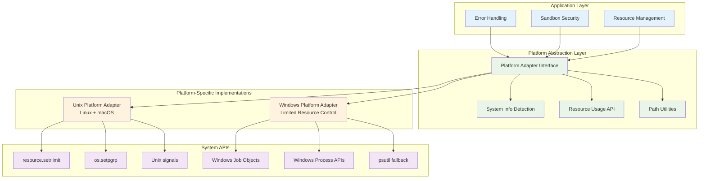

# Platform Abstraction Architecture

## Overview
This document describes the platform abstraction layer implemented in Mimir to ensure cross-platform compatibility across Windows, macOS, and Linux systems.

## Problem Statement
The original codebase contained platform-specific code that assumed Unix-like systems, particularly:
- Resource limiting using `resource.setrlimit()` (Unix-only)
- Memory usage reporting differences between Linux (KB) and macOS (bytes)
- Process group management using `os.setpgrp()` (Unix-only)
- Platform-specific path handling and executables

## Solution Architecture



## Implementation Components

### 1. Platform Detection (`SystemInfo`)
```python
@dataclass
class SystemInfo:
    platform: str          # 'Windows', 'Linux', 'Darwin'
    architecture: str       # 'x86_64', 'arm64', etc.
    python_version: str
    is_windows: bool
    is_linux: bool
    is_macos: bool
```

### 2. Resource Usage Abstraction (`ResourceUsage`)
```python
@dataclass
class ResourceUsage:
    memory_bytes: int
    memory_mb: float
    memory_percent: float
    cpu_time_seconds: float
    cpu_percent: float
    memory_limit_bytes: int
    cpu_limit_seconds: int
    memory_limit_exceeded: bool
    cpu_limit_exceeded: bool
```

### 3. Platform Adapter Interface (`PlatformAdapter`)
```python
class PlatformAdapter(ABC):
    @abstractmethod
    def set_memory_limit(self, limit_bytes: int) -> bool
    
    @abstractmethod
    def set_cpu_limit(self, limit_seconds: int) -> bool
    
    @abstractmethod
    def get_resource_usage(self, memory_limit: int, cpu_limit: int) -> ResourceUsage
    
    # Additional methods for file descriptors, processes, etc.
```

## Platform-Specific Implementations

### Unix Platform Adapter (Linux + macOS)
- **Full Resource Control**: Uses `resource.setrlimit()` for comprehensive resource limiting
- **Memory Handling**: Correctly handles Linux (KB) vs macOS (bytes) differences in `ru_maxrss`
- **Process Isolation**: Supports process groups via `os.setpgrp()`
- **Signal Management**: Unix signal handling for security

### Windows Platform Adapter
- **Limited Resource Control**: Windows has different resource management paradigms
- **Graceful Degradation**: Logs warnings for unsupported operations
- **Alternative Monitoring**: Uses psutil when available for better Windows support
- **Path Handling**: Windows-specific path normalization and executable detection

## Integration Points

### Error Handling Integration
```python
def create_error_context(component: str, operation: str, **kwargs) -> ErrorContext:
    # Before: platform.platform() - platform-specific implementation
    # After: get_platform_context() - abstracted platform information
    
    platform_info = get_platform_context()
    context = ErrorContext(
        platform=f"{platform_info['platform']} ({platform_info['architecture']})",
        # ... other context
    )
```

### Sandbox Security Integration
```python
class ResourceLimiter:
    def __init__(self):
        # Before: Direct resource.setrlimit() calls
        # After: Platform adapter for cross-platform resource management
        self.platform = get_platform_adapter()
    
    def set_process_limits(self):
        # Abstracted calls that work across platforms
        success = self.platform.set_memory_limit(self.limits["max_memory"])
```

### Process Isolation Integration
```python
def _setup_child_process(self):
    # Before: Assumed Unix-only functionality
    # After: Platform-aware process setup
    if is_unix_like():
        os.setpgrp()  # Unix process groups
    else:
        logger.debug("Process isolation limited on Windows")
```

## Cross-Platform Compatibility Matrix

| Feature | Linux | macOS | Windows | Implementation |
|---------|-------|-------|---------|----------------|
| Memory Limits | ✅ Full | ✅ Full | ⚠️ Limited | resource.setrlimit() vs monitoring |
| CPU Limits | ✅ Full | ✅ Full | ⚠️ Limited | resource.setrlimit() vs monitoring |
| Process Groups | ✅ Full | ✅ Full | ❌ None | os.setpgrp() not available |
| File Descriptors | ✅ Full | ✅ Full | ❌ Different | Windows uses handles differently |
| Memory Reporting | ✅ KB units | ✅ Byte units | ⚠️ Via psutil | Platform adapter handles conversion |
| Path Handling | ✅ POSIX | ✅ POSIX | ✅ Windows | Cross-platform path utilities |

## Backward Compatibility

The platform abstraction maintains 100% backward compatibility:
- Existing APIs unchanged
- Same resource limiting behavior on Unix systems
- Enhanced error reporting with platform context
- Graceful degradation on Windows (logs warnings instead of crashing)

## Testing Strategy

### Unit Tests
- Platform detection accuracy
- Resource adapter functionality per platform
- Error handling with platform context
- Path utilities across platforms

### Integration Tests  
- Sandbox functionality on different platforms
- Resource limiting effectiveness
- Process isolation where supported
- Error recovery and reporting

### Platform-Specific Tests
- Linux: Full resource control validation
- macOS: Memory unit conversion accuracy
- Windows: Graceful degradation behavior

## Future Enhancements

### Windows Resource Management
- **Windows Job Objects**: For proper process resource limiting
- **Performance Counters**: For better resource monitoring
- **Windows Containers**: For enhanced isolation

### Enhanced Monitoring
- **Real-time Metrics**: Continuous resource usage tracking
- **Alerting**: Threshold-based resource alerts
- **Historical Data**: Resource usage trends and analytics

### Container Integration
- **Docker Support**: Container-aware resource management
- **Kubernetes**: Integration with container orchestration
- **Cloud Platforms**: Platform-specific optimizations

## Migration Guide

For developers working with the codebase:

### Before (Platform-Specific)
```python
# Direct platform calls
if os.name == "posix" and os.uname().sysname != "Darwin":
    memory_bytes = memory_kb * 1024
else:
    memory_bytes = memory_kb

resource.setrlimit(resource.RLIMIT_RSS, (limit, limit))
```

### After (Platform-Abstracted)
```python
# Abstracted platform calls
platform = get_platform_adapter()
resource_usage = platform.get_resource_usage(memory_limit=limit)
platform.set_memory_limit(limit)
```

### Key Benefits
1. **Cross-Platform Compatibility**: Single codebase works across all platforms
2. **Maintainability**: Platform-specific code isolated in adapters
3. **Testability**: Easy to mock platform-specific behavior
4. **Extensibility**: New platforms can be added via new adapters
5. **Reliability**: Graceful degradation instead of crashes on unsupported features