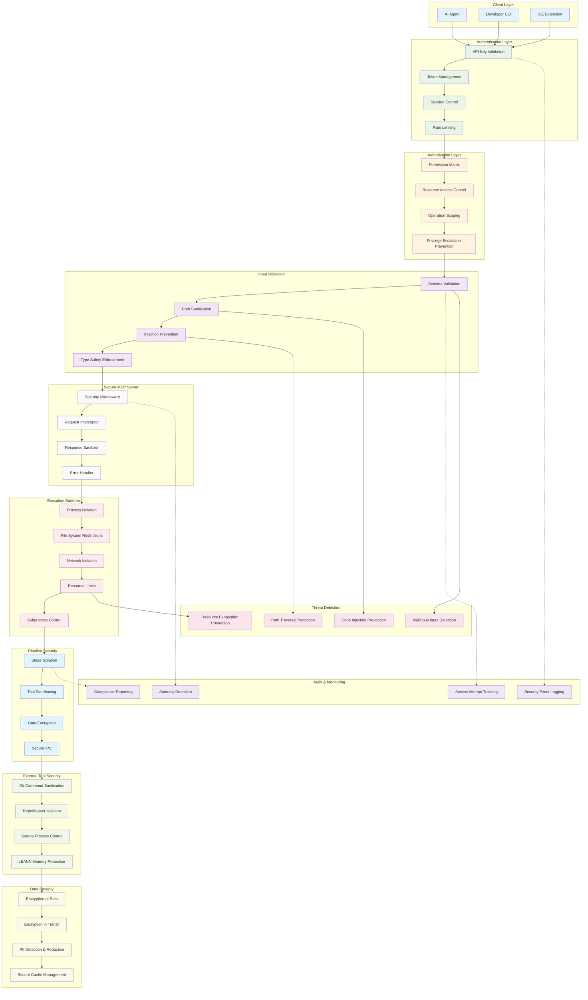

# Security Model Diagram

## Overview
This diagram illustrates the comprehensive security architecture of Mimir, including authentication, authorization, input validation, sandboxing, and audit logging.



## Security Components Detail

### Authentication Layer
- **API Key Validation**: Cryptographically secure API key verification
- **Token Management**: JWT-based session tokens with expiration
- **Session Control**: Active session monitoring and revocation capabilities
- **Rate Limiting**: Per-client request throttling to prevent abuse

### Authorization Layer
- **Permission Matrix**: Role-based access control with granular permissions
- **Resource Access Control**: Path-based and operation-specific authorization
- **Operation Scoping**: Limiting operations to authorized repository scopes
- **Privilege Escalation Prevention**: Continuous privilege validation

### Input Validation
- **Schema Validation**: Pydantic-based strict type and format validation
- **Path Sanitization**: Comprehensive path traversal attack prevention
- **Injection Prevention**: SQL, command, and code injection protection
- **Type Safety Enforcement**: Runtime type checking for all inputs

### Execution Sandbox
- **Process Isolation**: Separate processes for each external tool execution
- **File System Restrictions**: Chroot-like restrictions on file access
- **Network Isolation**: Prevented external network access during execution
- **Resource Limits**: Memory, CPU, and disk usage limitations
- **Subprocess Control**: Strict control over spawned processes

### Secure MCP Server
- **Security Middleware**: Request/response security processing
- **Request Interceptor**: Pre-processing security checks
- **Response Sanitizer**: Output sanitization and PII redaction
- **Error Handler**: Secure error reporting without information leakage

## Security Threat Model

### Identified Threats & Mitigations

#### 1. Path Traversal Attacks
**Threat**: Malicious clients attempting to access files outside authorized scope
**Mitigation**:
- Comprehensive path sanitization
- Chroot-style sandbox execution
- Whitelist-based file access control
- Realpath resolution to prevent symbolic link attacks

#### 2. Code Injection
**Threat**: Injection of malicious code through repository content or parameters
**Mitigation**:
- Strict input validation and sanitization
- Process isolation for all external tool execution
- Static analysis of processed content
- Secure subprocess execution with argument validation

#### 3. Information Disclosure
**Threat**: Accidental exposure of sensitive information in responses
**Mitigation**:
- PII detection and automatic redaction
- Response sanitization before client delivery
- Secure error handling without stack trace exposure
- Audit logging of all data access

#### 4. Denial of Service
**Threat**: Resource exhaustion attacks through expensive operations
**Mitigation**:
- Configurable resource limits per operation
- Request rate limiting per client
- Timeout controls on all external tool invocations
- Memory and CPU usage monitoring

#### 5. Privilege Escalation
**Threat**: Unauthorized access to system resources or elevated permissions
**Mitigation**:
- Minimal privilege principle for all operations
- Continuous permission validation
- Process isolation and sandboxing
- Regular security audit logging

## Security Configuration

### API Key Management
```python
class SecurityConfig:
    api_key_length: int = 64
    api_key_rotation_days: int = 90
    max_failed_attempts: int = 5
    lockout_duration: int = 3600  # seconds
```

### Sandbox Limits
```python
class SandboxConfig:
    max_memory_mb: int = 512
    max_cpu_percent: int = 50
    max_execution_time: int = 300  # seconds
    max_open_files: int = 100
    allowed_network_access: bool = False
```

### Input Validation Rules
```python
class ValidationConfig:
    max_path_length: int = 4096
    allowed_path_chars: str = "a-zA-Z0-9._/-"
    max_query_length: int = 1000
    allowed_file_extensions: list = [".py", ".ts", ".js", ".md", ...]
```

## Compliance & Audit

### Security Logging
- All authentication attempts (success/failure)
- Authorization decisions and access control violations
- Input validation failures and potential attacks
- Resource usage and limit violations
- External tool execution and sandbox events

### Audit Trail Requirements
- Immutable log storage with integrity verification
- Centralized log aggregation for security monitoring
- Retention policies for compliance requirements
- Automated anomaly detection and alerting

### Compliance Standards
- **OWASP Top 10**: Protection against common web application vulnerabilities
- **CWE/SANS Top 25**: Mitigation of most dangerous software errors
- **NIST Cybersecurity Framework**: Implementation of security controls
- **SOC 2 Type II**: Controls for security, availability, and confidentiality

## Security Testing Strategy

### Static Analysis
- **Semgrep**: Custom rules for security vulnerability detection
- **Bandit**: Python-specific security issue identification
- **Safety**: Dependency vulnerability scanning
- **CodeQL**: Advanced security pattern matching

### Dynamic Testing
- **Penetration Testing**: Regular security assessments
- **Fuzzing**: Input validation stress testing
- **Load Testing**: DoS resistance validation
- **Integration Testing**: End-to-end security workflow verification

### Security Metrics
- **Mean Time to Detect (MTTD)**: Security incident detection speed
- **Mean Time to Respond (MTTR)**: Security incident response time
- **False Positive Rate**: Security alert accuracy
- **Coverage**: Percentage of code covered by security tests