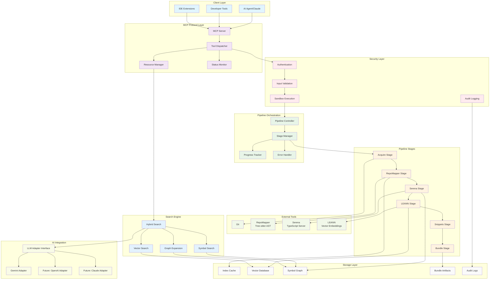

# System Architecture Diagram

## Overview
This diagram shows the high-level architecture of the Mimir Deep Code Research System, including all major components and their interactions.

## Component Responsibilities

### Client Layer
- **AI Agent/Claude**: Primary consumer of MCP protocol for code analysis
- **Developer Tools**: CLI tools and scripts for direct repository indexing
- **IDE Extensions**: Integration with development environments

### MCP Protocol Layer
- **MCP Server**: Main entry point implementing stdio MCP protocol
- **Tool Dispatcher**: Routes tool calls to appropriate handlers
- **Resource Manager**: Serves status updates, manifests, and artifacts
- **Status Monitor**: Tracks pipeline progress and system health

### Security Layer
- **Authentication**: API key and token validation
- **Input Validation**: Sanitizes and validates all inputs
- **Sandbox Execution**: Isolated execution environment for external tools
- **Audit Logging**: Comprehensive security event logging

### Pipeline Orchestration
- **Pipeline Controller**: Orchestrates the complete indexing workflow
- **Stage Manager**: Manages individual stage execution and dependencies
- **Progress Tracker**: Reports real-time progress to clients
- **Error Handler**: Manages failures and recovery strategies

### Pipeline Stages
- **Acquire**: Git-based file discovery and change detection
- **RepoMapper**: AST analysis and dependency graph construction
- **Serena**: TypeScript symbol resolution and analysis
- **LEANN**: Vector embedding generation
- **Snippets**: Code snippet extraction and context preparation
- **Bundle**: Artifact packaging and manifest generation

### External Tools
- **Git**: Version control integration for file tracking
- **RepoMapper**: Tree-sitter based AST parsing and analysis
- **Serena**: TypeScript language server integration
- **LEANN**: CPU-based vector embedding generation

### Storage Layer
- **Index Cache**: Persistent caching of intermediate results
- **Vector Database**: High-dimensional embedding storage
- **Symbol Graph**: Structured symbol relationships
- **Bundle Artifacts**: Complete index packages for distribution
- **Audit Logs**: Security and operational audit trails

### Search Engine
- **Hybrid Search**: Multi-modal search orchestration
- **Vector Search**: Semantic similarity search using embeddings
- **Symbol Search**: Exact and fuzzy symbol name matching
- **Graph Expansion**: Relationship-based result expansion

### AI Integration
- **LLM Adapter Interface**: Abstract interface for multiple AI providers
- **Gemini Adapter**: Google Gemini AI integration (implemented)
- **OpenAI Adapter**: OpenAI API integration (planned)
- **Claude Adapter**: Anthropic Claude integration (planned)

## Data Flow Summary

1. **Indexing Flow**: Client → MCP Server → Security Layer → Pipeline Controller → 6 Pipeline Stages → External Tools → Storage Layer
2. **Search Flow**: Client → MCP Server → Search Engine → Storage Layer → Results
3. **AI Analysis Flow**: Client → MCP Server → Search Engine → AI Integration → LLM Adapter → Results
4. **Status Flow**: Pipeline → Status Monitor → Resource Manager → Client

## Key Design Principles

- **Zero-configuration**: Minimal setup required for basic operation
- **Incremental processing**: Smart caching and delta detection
- **Concurrent execution**: Async operations where dependencies allow
- **Robust error handling**: Graceful degradation and recovery
- **Extensible architecture**: Plugin-based design for future enhancements